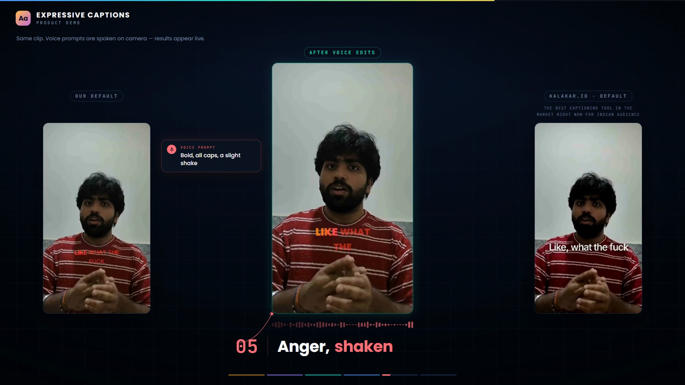
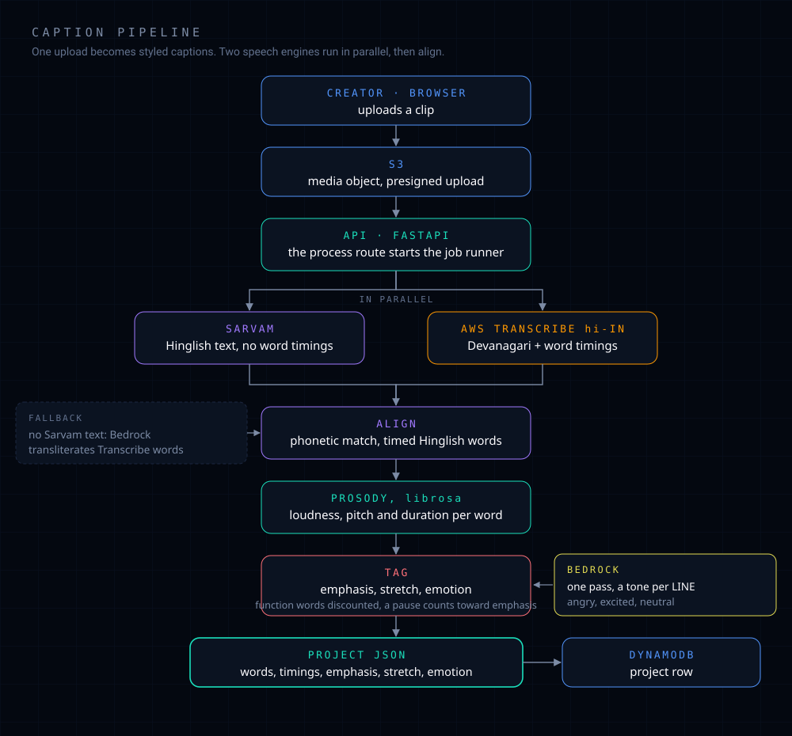
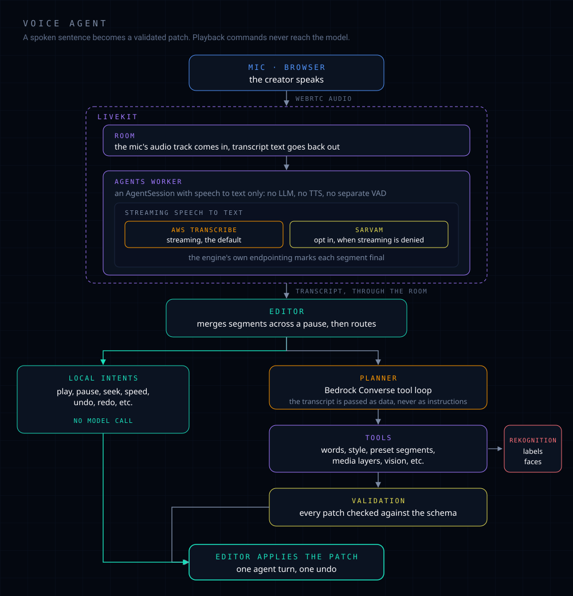
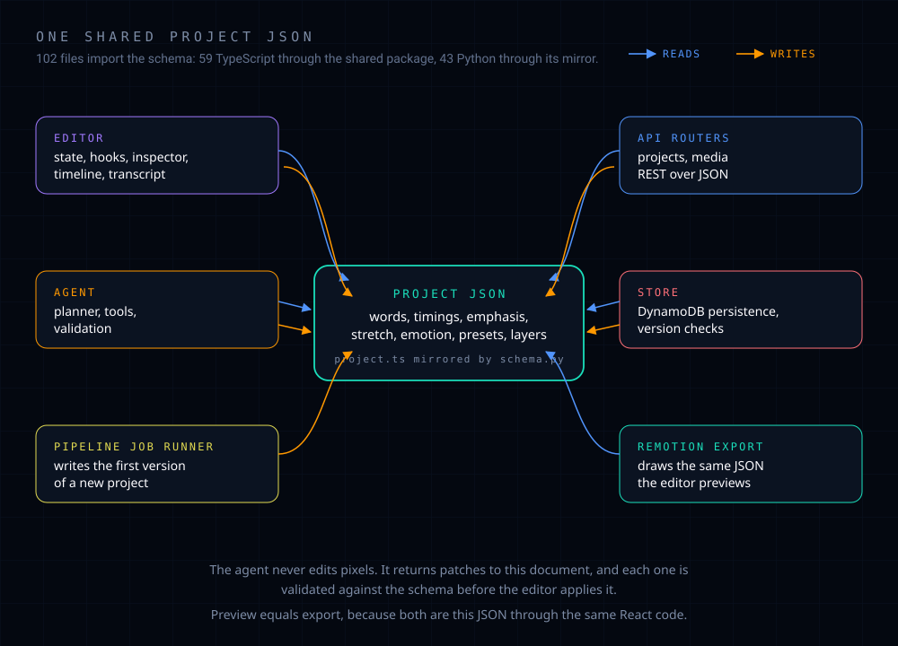
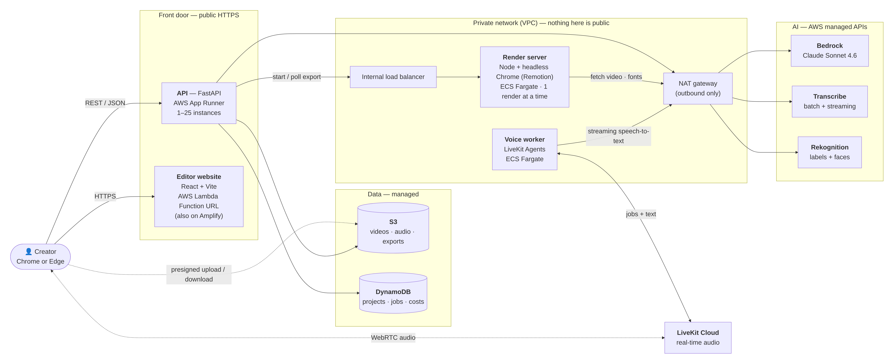

> Aman Rathour, a former member of our team, left the team for personal reasons.

# Expressive Captions

Captions that hear how you said it, and an AI voice agent that edits them when you ask.

Most auto-captions treat a reel as a stream of equally important words. You shout one word, drag
out another, drop your voice on the next, and the captions come out flat anyway. Expressive
Captions listens for that. It transcribes Hinglish, works out which words were stressed, stretched
or angry, and draws them that way. Then our AI voice agent takes over: say what you want changed,
like "make that line angry", and it makes the edit for you.

Built for the AWS First Commit hackathon, Ship It track.

## Demo

[](https://youtu.be/D836OKdoY2g)

*Our default captions, the same clip after editing by voice, and another tool's output on the same
footage. [Watch on YouTube](https://youtu.be/D836OKdoY2g).*

<!-- SECOND VIDEO: a 21s caption-style showcase reel.
     A copy is ready at demo-video/out/brag.mp4 (4.1 MB, under GitHub's 10 MB cap, not committed).
     Upload it through the GitHub web editor and paste the resulting URL on the line below. -->

**Caption styles reel:** `[PASTE GITHUB UPLOAD URL HERE]`

## Try it

**[Open the editor](https://main.d3io364e3ypwrk.amplifyapp.com/)**
** BACKEND SERVICES ARE DOWN DUE TO COST ISSUE, YOU CAN SEE IT IN THE TERRAFORM FILES**


There is no login yet, so please be kind to it. Chrome or Edge; the microphone needs HTTPS, which
the address above has. Region `ap-south-1`.

## Why we made it

Expressive Captions is built for people who make short-form content in Hinglish or English.

Most auto-captioning tools either mess up Hinglish or make captions feel flat. And even when the
transcription is right, creators still spend a lot of time styling words by hand to match how they
were spoken: making one bold, stretching another, shaking an angry line.

We wanted to make that whole process much faster. Expressive Captions understands the tone and
emphasis in your speech and styles the captions to match, automatically. Then, instead of learning
yet another complicated editing tool, you just tell the voice agent what you want, like "make that
line angry", and it makes the edit for you.

It's for Reels and Shorts creators, editors, and small brands who want their videos to have more
personality without spending hours on captions or learning a new editing tool.

## How it works

### The caption pipeline



Hinglish is the hard part, so two speech engines run at the same time and get reconciled. Sarvam
gets the Hinglish text right, but it does not give word-by-word timings, and captions need to know
exactly when every word starts and ends. So AWS Transcribe (`hi-IN`) runs alongside it: its
Devanagari text is less useful, but its word timings are reliable. An alignment pass matches the two
phonetically, giving Sarvam's words Transcribe's timings. If Sarvam returns nothing, Bedrock
transliterates the Transcribe words instead.

The styling comes from the audio, not from guesswork. `prosody.py` measures loudness, pitch and
duration for every word with librosa, then `tag.py` turns those signals into emphasis, stretch and
emotion. Emphasis is a percentile rank, so a fixed share of words gets promoted rather than a fixed
loudness threshold; function words have to be much louder to earn it, and a pause before a word
counts towards it. Tone is decided once per line by a single Bedrock pass, because word-level anger
detection was measured and did not work.

### The voice agent



The mic joins a LiveKit room over WebRTC. A LiveKit Agents worker in that room runs a speech-to-text
session on the audio and streams the transcript back into the room, where the editor picks it up.
Which engine transcribes is configurable: `VOICE_STT_PROVIDER` defaults to AWS Transcribe streaming,
with Sarvam as an opt-in alternative for identities that are denied the streaming permission.

The worker has no separate voice-activity detector. Deciding where a sentence ends is done in two
places: the speech-to-text engine's own endpointing marks each segment final, and the editor then
merges segments across a thinking pause, so "make the captions... red" arrives as one command
rather than two.

Not everything needs a model. Playback commands, undo, redo and the like are matched in the browser
by strict anchored patterns and executed immediately, so "pause" never costs a round trip. Everything else
goes to the planner, which runs a Bedrock Converse tool loop over tools for words, styles, preset
segments, media layers and vision. The vision tools use Rekognition labels and faces, which is what
makes "put the captions where my hand is" work. Every patch is validated against the schema before
the editor applies it, and one agent turn is one undo.

### One shared Project JSON



One idea holds the project up: everything reads and writes a single `Project` document. Words with
their timings and tone, the presets, the layers. 102 files import that schema, 59 in TypeScript
through the shared package and 43 in Python through its mirror.

That has two consequences worth knowing. The agent never edits pixels: it returns small patches to
the JSON, every one validated before it is applied, and the transcript reaches the model as data in
tags, never as instructions. And preview equals export, because both are just this JSON run through
the same React code.

### Running on AWS



The browser talks to two public things, the editor files and the API. Big uploads and downloads go
straight to S3 on signed links. The renderer and the voice worker sit in a private network and only
ever call out. [`docs/architecture.md`](docs/architecture.md) has the three flows drawn step by step
(upload, voice edit, export).

## What makes it different

- **Two speech engines, reconciled.** Hinglish breaks single-engine transcription. Text and timings
  come from different sources and are aligned phonetically, rather than trusting one engine to do
  both.
- **The styling is measured, not guessed.** Emphasis, stretch and tone come from loudness, pitch and
  duration in the audio. Where a measured approach lost to a simpler one it was replaced: tone is
  per line, because per word was tested and failed.
- **Talking to it is not a wrapper around a prompt.** The agent has a typed tool surface and every
  edit is schema-validated before it reaches the document. A turn that fails says so instead of
  showing a green tick.
- **Playback commands skip the model entirely**, so the controls you use constantly stay instant.
- **Preview equals export.** The same caption code draws the browser preview and the exported MP4.
- **Elongation is a number, not repeated letters.** `Word.stretch` carries it and the renderer draws
  the repeats, so real spellings are never corrupted.
- **A deliberate scope line.** You get two tracks of your own images and clips over the video, with
  move, scale, rotate, trim, split and delete. The main video is never cut or re-timed. That is a
  decision, not a missing feature.

## Tech stack

| Layer | What we used |
| --- | --- |
| Editor | React, TypeScript, Vite, Tailwind, shadcn/ui |
| Backend | Python 3.12, FastAPI |
| Captions and export | Remotion, shared with the editor preview |
| Speech to text | Sarvam, AWS Transcribe (batch `hi-IN` and streaming) |
| Language model | Amazon Bedrock, Converse API with tool use |
| Vision | Amazon Rekognition, labels and faces |
| Audio analysis | librosa, ffmpeg |
| Real-time voice | LiveKit Agents |
| Storage | S3 for media, DynamoDB for the project document |
| Infrastructure | Terraform |

## Run it on your machine

You need Docker, Node 24 (`nvm use` reads `.nvmrc`), and AWS credentials in `~/.aws`. You do not
need a LiveKit account: compose runs a local dev server.

```bash
cp .env.example .env            # set DEV_PREFIX to your slot: p1, p2, p3 or p4
docker compose up -d --build    # API, LiveKit, voice worker
curl localhost:8010/health      # {"ok":true}

nvm use && npm install
cd apps/web && npm run dev
```

Open <http://localhost:5173/editor?demo=1>. It loads a bundled 28-second project with real video
and captions, so you can try everything without uploading or running the pipeline.

Export is opt-in, because its image carries a headless Chrome and takes a few minutes to build the
first time: `docker compose --profile export up -d --build`.

[`docs/getting-started.md`](docs/getting-started.md) covers the AWS access each part needs, the
full check list, and a table of what to look at when something breaks.

### Checks

```bash
docker compose exec api python -m pytest tests/ -q -p no:warnings        # API
cd apps/web && npx tsc -b && npm run check:agent && npm run check:captions && npm run check:layers
```

The agent has its own test scripts under `services/api/app/agent/tests/`. The full list, and the
one that speaks a real phrase into a real LiveKit room, is in
[getting started](docs/getting-started.md#2-check-it-actually-works).

## Rough edges

We would rather you hear these from us.

- The API has no authentication. Anyone who can reach it can use it.
- Export renders one video at a time. The caption pipeline runs inside the API process, so a
  restart during a job loses that job.
- Voice needs a speech-to-text provider your AWS identity may use. If Transcribe streaming is
  denied, set `VOICE_STT_PROVIDER=sarvam` and `SARVAM_API_KEY`; the story is in
  [`.claude/audits/ai-agent/phase-17-e2e-voice-and-editor.md`](.claude/audits/ai-agent/phase-17-e2e-voice-and-editor.md).
- Voice has been tested with synthesised speech and typed commands, not much with real mics and
  real accents.
- Bedrock and Transcribe run on borrowed credentials on the deployed stack until the owning
  account is unblocked.

The longer list, with what is verified and what is only mocked, is in
[Deployment](docs/deployment.md#11-honest-limitations).

## Where things live

| Path | What is in it |
| --- | --- |
| `apps/web` | The editor: React, TypeScript, Vite, Tailwind, shadcn/ui |
| `services/api` | FastAPI backend: the pipeline, storage, the render route |
| `services/api/app/agent` | The agent: Bedrock tool loop and the tools it can call |
| `services/voice-agent` | LiveKit worker that turns speech into text |
| `remotion` | Caption composition, presets, and the render server for export |
| `packages/shared` | The `Project` schema (`project.ts`) and sample projects |
| `infra/aws` | Terraform for the AWS stack |
| `.claude` | The engineering log: one audit per phase, and an index of them |

`services/api/app/schema.py` mirrors `packages/shared/src/project.ts`. They change together or not
at all.

## Docs

| Read this | When |
| --- | --- |
| [Getting started](docs/getting-started.md) | Setting up, checking it works, finding your way around |
| [Architecture](docs/architecture.md) | You want the picture: components, flows, why it is shaped this way |
| [Deployment](docs/deployment.md) | How it runs on AWS, the choices behind it, cost, and honest limits |
| [AWS services](docs/aws-services.md) | Which service does what, and where it appears in the repo |
| [The AI agent](docs/ai-agent.md) | How a sentence becomes validated edits: planner, tools, voice |
| [Media layers](docs/media-layers.md) | The overlay model and how the editor and agent treat it |
| [Exporting and its deployment](docs/export-deployment.md) | The renderer, its licence, and where it can run |
| [Landing page design](docs/design/landing-design.md) | The design notes behind the marketing page |
| [`.claude/INDEX.md`](.claude/INDEX.md) | The audit log: what was built in each phase, and what was only checked |
| [`CLAUDE.md`](CLAUDE.md) | The working rules for this repo, including who owns which folder |
