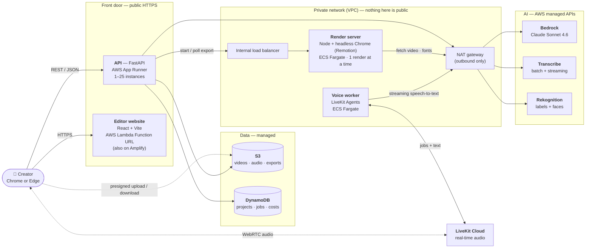
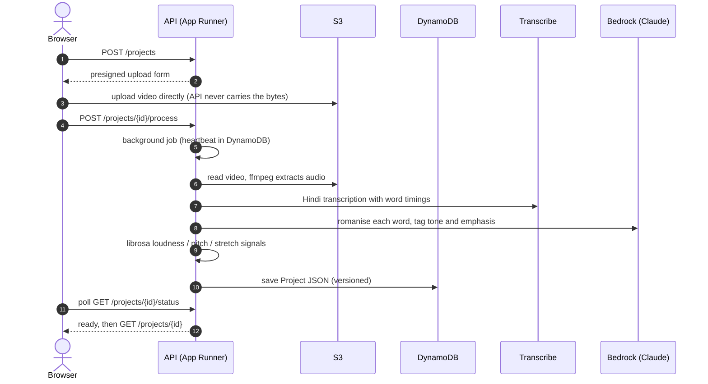
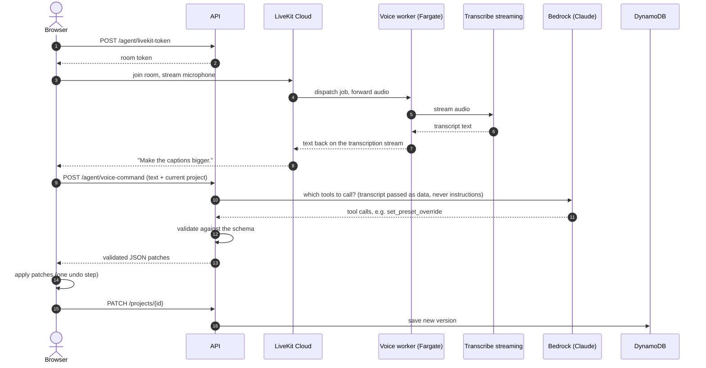
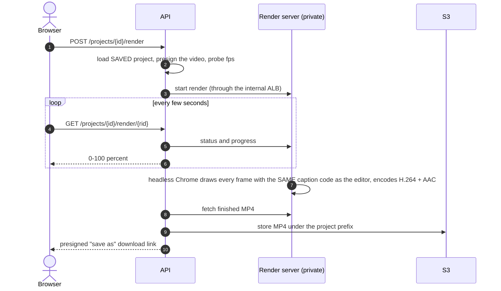

# Architecture — Expressive Captions

Hinglish short-form video in, **tone-aware captions** out (emphasis, stretched words, angry shake), editable **by voice**,
exportable as an **MP4**. This page is the one-page picture of how it is built and how it runs on AWS.
Diagrams are [Mermaid](https://mermaid.js.org/) — GitHub draws them; [`images/architecture-system.png`](images/architecture-system.png) is the same main
diagram as an image for chat/slides. More detail: [`deployment.md`](deployment.md) (the *why* of every choice, scalability, limits).

## 1. The system at a glance

**Reading it:** the browser talks to two public things (the editor files and the API), uploads/downloads big files straight to S3
with temporary signed links, and streams microphone audio to LiveKit Cloud. Everything heavy or unsafe to expose — the renderer and
the voice worker — sits in a private network and only makes outbound calls (through the NAT gateway) or answers the API.

## 2. Three flows

### 2a. Upload a reel → captions (~40 s for a 23 s clip)

### 2b. Edit by voice — "make the captions bigger"

### 2c. Export → MP4 (~2.5–3 min for a 23 s clip)

## 3. The one idea that holds it together: the shared Project JSON

Every feature reads and writes **one** document (`packages/shared/src/project.ts`, mirrored by `services/api/app/schema.py`).

| Part of the `Project` | What it holds |
|---|---|
| `words[]` | each word: text, `startMs`/`endMs` (integer ms), `emphasis`, `emotion` (neutral/angry/excited), `stretch`, optional `single`, `emoji`, per-word `style` override, measured `signals` (loudness, pitch, duration) |
| `presetId` (+ `presetOverride`) | the base look — one of 7 presets (`rangmanch`, `chamak`, `nazm`, `dhamaka`, `mrbeast`, `minimal`, `hinglish-bold`); emphasis and emotion are per-word layers on top |
| `overlays[]` | timed text overlays |
| `layers[]` | uploaded images/videos placed over the clip (2 tracks), with placement, trim and transform |
| video meta | `videoUrl` (a fresh presigned link on every read), `width`, `height`, `durationMs`, settings |

Consequences that shape the architecture:
- **The AI never edits pixels.** The agent returns small **validated patches** to this JSON. Tool calls are checked against the schema before they are applied; the transcript is passed to the model as *data in tags*, never as instructions.
- **Preview = export.** The editor's live preview and the exported MP4 are drawn from the same JSON by the **same caption React code** (the render server imports the editor's real `CaptionRenderer`), so what you see is what you export.
- **Times are integer milliseconds; positions are percentages (0–100) of the frame** — resolution-independent.
- A project is one versioned DynamoDB document (store limit 350 KB), so concurrent edits cannot silently overwrite each other.

## 4. What runs where

| Component | Tech | Runs on | Code |
|---|---|---|---|
| Editor | React, TypeScript, Vite, Tailwind, shadcn/ui | AWS Lambda Function URL (static files); also Amplify | `apps/web` |
| API | Python 3.12, FastAPI, boto3, ffmpeg, librosa | AWS App Runner (behind a VPC connector) | `services/api` |
| Agent (tool-calling) | Bedrock Converse API, schema-validated tools | inside the API | `services/api/app/agent` |
| Render server | Node, Remotion, headless Chrome | ECS Fargate, private subnet, internal ALB | `remotion/` |
| Voice worker | LiveKit Agents (Python) → Transcribe streaming | ECS Fargate, private subnet | `services/voice-agent` |
| Storage | S3 (videos, exports), DynamoDB (projects, jobs, cost events) | managed | — |
| Real-time audio | LiveKit Cloud | managed (external) | — |
| Infrastructure | Terraform | `infra/aws/` | — |

## 5. Design decisions (short)

1. **Browser → S3 directly for big files** (presigned URLs): the API is never in the data path of a video.
2. **Renderer is private and separate:** it has no auth and fetches any URL it is given, and Chrome needs 1–2 GB — so it lives in a private subnet behind an internal load balancer, reachable only by the API.
3. **Voice is a worker, not a web endpoint:** a long-running process that dials out to LiveKit Cloud; managed WebRTC avoids running our own media servers.
4. **Serverless / managed everywhere it fits:** App Runner, Fargate, Lambda, DynamoDB (pay-per-request), S3 — no servers to patch.
5. **Everything is Terraform.** `terraform plan` shows no drift against the running system.
6. **Editor on Lambda, not CloudFront:** CloudFront is refused on this AWS account and the microphone needs HTTPS; a Lambda Function URL gives HTTPS with no domain.

## 6. Limits worth knowing (full list in [`deployment.md`](deployment.md) §11)

- Export renders **one video at a time** (state is in the render task's memory). Scaling path: shared job state + queue, or Remotion Lambda.
- The caption pipeline runs **inside the API process**; a restart kills a running job (reported as "worker lost" after 120 s). Path: queue + worker.
- **No authentication** on the API yet; Bedrock/Transcribe currently run on borrowed credentials; not load-tested; one region, one NAT gateway.

## 7. Live

- Editor: https://4ofryng45bbr7en765off7otja0yuamo.lambda-url.ap-south-1.on.aws (second address: https://master.dnb761en5gcll.amplifyapp.com)
- API health: https://pra22j2hgp.ap-south-1.awsapprunner.com/health
- Region: ap-south-1 (Mumbai)
